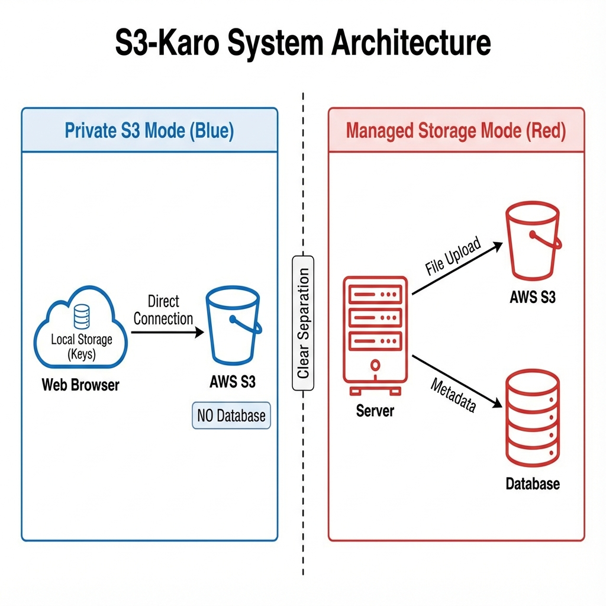
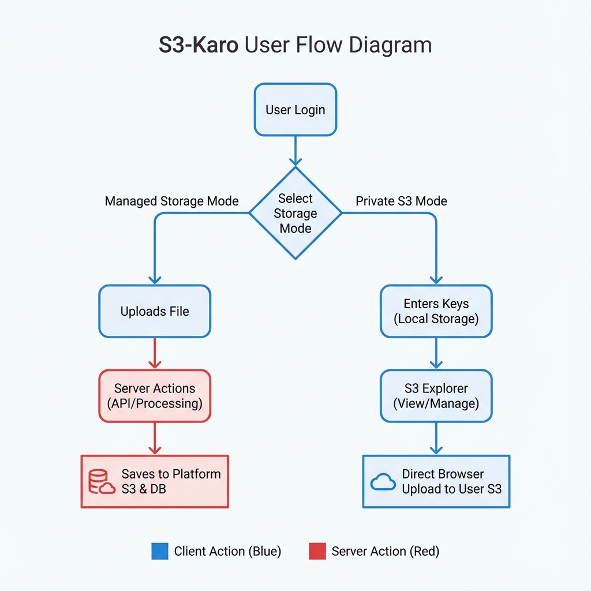

# S3Karo System Architecture

## Overview

S3Karo is a privacy-first file storage platform that offers two distinct storage modes: **Managed Storage** and **Private S3 Mode**. This dual-mode architecture provides users with maximum flexibility while maintaining security and privacy.

---

## System Architecture



### Storage Modes

#### 🔵 Private S3 Mode (Blue)

**Privacy-First Approach**

- User's S3 credentials stored **locally in browser** (encrypted with AES-256-CBC)
- **Direct connection** from browser to user's S3 bucket
- **Zero server involvement** in file transfers
- **No database** - complete privacy

**Key Features:**

- ✅ Complete data ownership
- ✅ No server-side storage of credentials
- ✅ Direct browser-to-S3 communication
- ✅ Client-side encryption before storage

**Flow:**

1. User enters S3 credentials in browser
2. Credentials encrypted and stored in localStorage
3. Direct file uploads/downloads to user's S3 bucket
4. No metadata stored on our servers

#### 🔴 Managed Storage Mode (Red)

**Platform-Managed Approach**

- Files uploaded to **platform's S3 bucket**
- Metadata stored in **PostgreSQL database**
- Server handles file processing and management
- Integrated analytics and search

**Key Features:**

- ✅ Managed infrastructure
- ✅ Built-in analytics dashboard
- ✅ Global search across files
- ✅ Automatic backups and redundancy

**Flow:**

1. User uploads file through web interface
2. Server processes and stores in platform S3
3. Metadata saved to database
4. File accessible through dashboard

---

## User Flow Diagram



### Authentication & Mode Selection

1. **User Login**
   - JWT-based authentication
   - Secure session management
   - Password hashing with bcryptjs

2. **Storage Mode Selection**
   - User chooses between Managed or Private S3
   - Mode preference saved per session
   - Seamless switching between modes

### Managed Storage Flow (🔴 Server Actions)

```
User → Upload File → Server Processing → Platform S3 + Database
```

1. File upload through web interface
2. Server validates and processes file
3. Stores in platform's S3 bucket
4. Saves metadata to PostgreSQL
5. Returns file URL and metadata

### Private S3 Flow (🔵 Client Actions)

```
User → Enter Keys → Local Storage → S3 Explorer → Direct Upload to User's S3
```

1. User enters S3 credentials
2. Credentials encrypted in browser
3. Stored in localStorage (never sent to server)
4. S3 Explorer manages bucket operations
5. Direct browser-to-S3 file transfers

---

## Technology Stack

### Frontend

- **Framework**: Next.js 16 (App Router)
- **Language**: TypeScript
- **Styling**: Tailwind CSS
- **State Management**: Zustand
- **File Upload**: React Dropzone

### Backend

- **Runtime**: Node.js
- **API**: Next.js API Routes
- **Authentication**: JWT + bcrypt
- **Database**: PostgreSQL + Drizzle ORM

### Storage

- **Managed**: AWS S3
- **Private**: User's S3-compatible storage
- **Encryption**: AES-256-CBC (client-side)

### Infrastructure

- **Hosting**: Vercel (recommended)
- **Database**: Neon/Supabase/Railway
- **CDN**: CloudFront (optional)

---

## Security Architecture

### Client-Side Security

**Credential Encryption**

```typescript
// S3 credentials encrypted before storage
const encrypted = await encryptS3Config(
  {
    bucket,
    region,
    accessKeyId,
    secretAccessKey,
  },
  userId
);
localStorage.setItem("s3_config", encrypted);
```

**Features:**

- AES-256-CBC encryption
- User-specific encryption keys
- Never transmitted to server
- Automatic cleanup on logout

### Server-Side Security

**Authentication**

- JWT tokens with secure secrets
- HTTP-only cookies
- CSRF protection
- Rate limiting (Upstash Redis)

**Data Protection**

- Password hashing (bcryptjs)
- Input validation (Zod)
- SQL injection prevention (Drizzle ORM)
- XSS protection

---

## Database Schema

### Managed Storage Tables

**users**

- id, email, fullName, password (hashed)
- avatar, createdAt

**files**

- id, name, type, size, url
- userId, bucketFileId, createdAt

**subscriptions** (optional)

- id, userId, plan, status
- currentPeriodEnd

### Private S3 Mode

**No database tables** - all data stays in user's S3 bucket and browser localStorage.

---

## API Architecture

### Public Routes

- `POST /api/auth/signin` - User login
- `POST /api/auth/signup` - User registration
- `GET /api/health` - Health check

### Protected Routes (Managed Storage)

- `GET /api/files` - List user files
- `POST /api/files` - Upload file
- `DELETE /api/files/[id]` - Delete file
- `GET /api/storage/stats` - Storage analytics

### Private S3 Routes

- All operations happen **client-side**
- No API calls for file operations
- Direct S3 SDK usage in browser

---

## Deployment Architecture

### Recommended Setup

```
┌─────────────────┐
│   Vercel Edge   │ ← Next.js App
└────────┬────────┘
         │
    ┌────┴────┐
    │         │
┌───▼───┐ ┌──▼──────┐
│  Neon │ │   S3    │
│  DB   │ │ Bucket  │
└───────┘ └─────────┘
```

**Components:**

- **Vercel**: App hosting + Edge functions
- **Neon**: PostgreSQL database
- **S3**: File storage (managed mode)
- **CloudFront**: CDN (optional)

---

## Performance Optimizations

### File Upload

- Multipart upload for large files (>100MB)
- Chunked uploads with resume capability
- Progress tracking
- Parallel uploads

### Caching

- Next.js static generation
- CDN for file delivery
- Browser caching for assets
- Redis for rate limiting

### Database

- Indexed queries
- Connection pooling
- Prepared statements
- Query optimization

---

## Scalability

### Horizontal Scaling

- Stateless API design
- JWT-based auth (no sessions)
- S3 for file storage (infinite scale)
- Database connection pooling

### Vertical Scaling

- Optimized queries
- Lazy loading
- Code splitting
- Image optimization

---

## Monitoring & Analytics

### Application Metrics

- File upload/download counts
- Storage usage per user
- API response times
- Error rates

### User Analytics

- Storage mode preferences
- File type distribution
- Upload patterns
- Feature usage

---

## Future Enhancements

- [ ] Real-time collaboration
- [ ] File versioning
- [ ] Advanced sharing permissions
- [ ] Mobile apps (iOS/Android)
- [ ] Desktop apps (Electron)
- [ ] API for third-party integrations

---

**Built with ❤️ by DesignByte**
