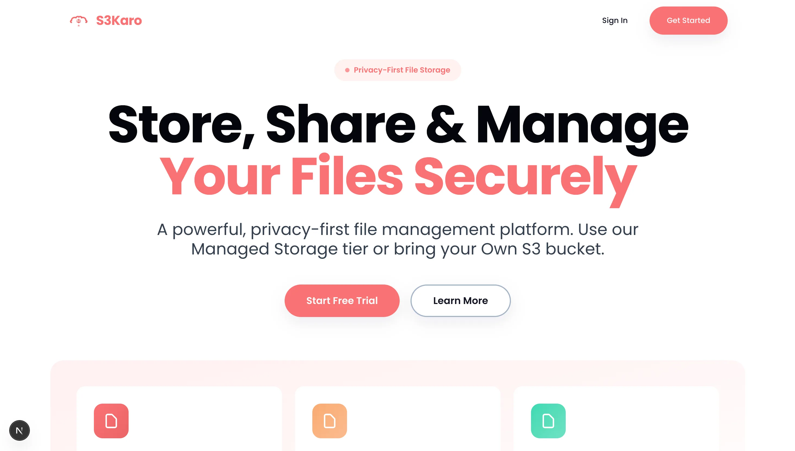

# S3Karo - Privacy-First File Storage Platform



> A powerful, privacy-first file management platform. Use our Managed Storage tier or bring your Own S3 bucket.

## ✨ Features

- 🔒 **Privacy-First** - Your S3 credentials are encrypted with AES-256-CBC in the browser. We never see or store your credentials.
- 🗄️ **Dual Storage Modes** - Switch between Managed Storage and your Own S3 instance seamlessly. Full control, maximum flexibility.
- 🔍 **Global Search** - Find files instantly across all storage tiers with advanced sorting and filtering options.
- 📊 **Analytics Dashboard** - Interactive charts showing storage usage, recent uploads, and file-type summaries.
- 📱 **Mobile Responsive** - A pixel-perfect, mobile-friendly UI built with modern aesthetics. Access your files anywhere.
- ⚙️ **Advanced Actions** - Rename, share, delete, and download files with a modern, intuitive interface.

## 🚀 Tech Stack

- **Framework**: Next.js 16 (App Router)
- **Language**: TypeScript
- **Database**: PostgreSQL with Drizzle ORM
- **Authentication**: JWT with bcrypt
- **Storage**: AWS S3 / Custom S3-compatible storage
- **Styling**: Tailwind CSS
- **UI Components**: Radix UI + Custom Components
- **File Upload**: React Dropzone with multipart upload support
- **State Management**: Zustand

## 📦 Getting Started

### Prerequisites

- Node.js 18+ and pnpm
- PostgreSQL database
- AWS S3 bucket (optional - for managed storage)

### Installation

1. **Clone the repository**

   ```bash
   git clone https://github.com/designbyte-official/S3karo-ai.git
   cd S3karo-ai
   ```

2. **Install dependencies**

   ```bash
   pnpm install
   ```

3. **Set up environment variables**

   ```bash
   cp .env.example .env.local
   ```

   Fill in your environment variables in `.env.local`:
   - `DATABASE_URL` - PostgreSQL connection string
   - `JWT_SECRET` - Secret key for JWT tokens (generate with `openssl rand -base64 32`)
   - `AWS_REGION` - AWS region for S3
   - `AWS_CDN_URL` - CDN URL for file delivery (optional)

4. **Set up the database**

   ```bash
   pnpm db:push
   ```

5. **Run the development server**

   ```bash
   pnpm dev
   ```

6. **Open [http://localhost:3000](http://localhost:3000)**

## 🔐 Security Features

- **Client-Side Encryption** - S3 credentials encrypted in browser before storage
- **JWT Authentication** - Secure token-based authentication
- **Password Hashing** - bcryptjs for secure password storage
- **Environment Variables** - All secrets externalized
- **Input Validation** - Zod schemas for data validation
- **File Upload Security** - Proper validation and sanitization

## 📁 Project Structure

```
s3-karo/
├── app/                    # Next.js app directory
│   ├── (auth)/            # Authentication pages
│   ├── (dashboard)/       # Dashboard pages
│   ├── (marketing)/       # Landing page
│   └── api/               # API routes
├── components/            # Reusable components
│   ├── common/           # Common components
│   ├── form-inputs/      # Form input components
│   └── ui/               # UI components (Radix)
├── features/             # Feature modules
│   ├── auth/            # Authentication
│   ├── home/            # Landing page
│   ├── managed-storage/ # Managed storage
│   └── private-s3/      # Private S3
├── lib/                 # Utilities and configurations
│   ├── database/       # Database queries
│   ├── encryption/     # Encryption utilities
│   └── utils/          # Helper functions
└── public/             # Static assets
```

## 🎨 Design System

S3Karo features a premium "poeru" aesthetic with:

- Custom icon-based logo
- Vibrant brand colors (`#FA7275`)
- Responsive typography system
- Smooth animations and transitions
- Glassmorphism effects
- Premium shadows and hover states

## 📝 Available Scripts

```bash
pnpm dev          # Start development server
pnpm build        # Build for production
pnpm start        # Start production server
pnpm lint         # Run ESLint
pnpm type-check   # Run TypeScript type checking
pnpm db:push      # Push database schema
pnpm db:studio    # Open Drizzle Studio
```

## 🌐 Deployment

### Vercel (Recommended)

1. Push your code to GitHub
2. Import your repository in Vercel
3. Add environment variables
4. Deploy!

### Other Platforms

The app can be deployed to any platform that supports Next.js:

- Netlify
- Railway
- Render
- AWS Amplify

Make sure to set all environment variables from `.env.example`.

## 📚 Documentation

Detailed documentation is in the [`docs/`](./docs) folder:

- [**Architecture**](./docs/ARCHITECTURE.md) – System design, security, and database
- [**API reference**](./docs/API.md) – Managed storage API (auth, endpoints, examples)
- [**Project structure**](./docs/PROJECT_STRUCTURE.md) – Directory layout
- [**Upload architecture**](./docs/UPLOAD_ARCHITECTURE.md) – Presigned URLs and upload flow
- [**Redis setup**](./docs/REDIS_SETUP.md) – Optional rate limiting with Upstash

See [docs/README.md](./docs/README.md) for the full index. For local/internal docs, see [local-docs/](./local-docs).

## 📄 License

This project is private and proprietary.

## 🤝 Contributing

This is a private project. For questions or issues, please contact the maintainers.

---

**Built with ❤️ by DesignByte**
